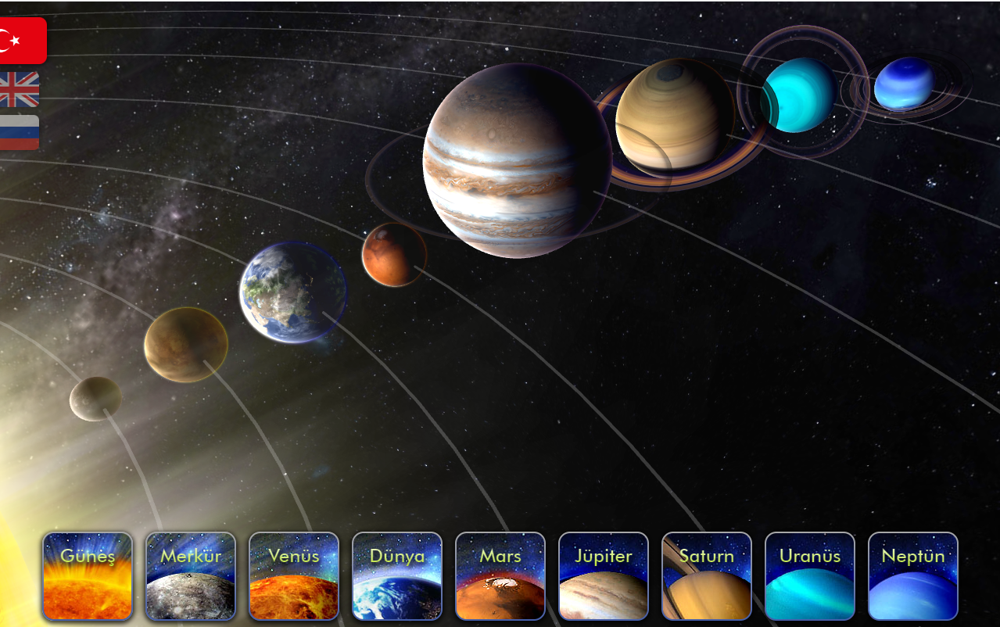

## [Letonya Doğa Tarihi Müzesi](https://www.dabasmuzejs.gov.lv/) - Solar System

1280x800 dokunmatik ekranlı cihazlar için web uygulaması. Güneş sistemimizin animasyonlu temsili ve her gezegenin kısa açıklaması ile tamamlayıcı Güneş sistemi vitrini.




Bu proje nasıl kurulur ve build edilir:

**Geliştirme ortamını kurun**


1) Install docker, docker-compose, Node.js/npm
2) Clone repo
```
git clone https://github.com/onurozkn/solar-system-display
```

3) Install dependencies
```
npm install
```

4) Run dev server
```
npm run serve
```

**Üretim sürümünü oluşturun ve test edin**

1) Run build
```
npm run build
```


2) Docker container başlatma:
```
docker-compose up -d
```

3) Galaksimizde bulunan en iyi gezegenlerden bazılarının keyfini çıkarın:  http://localhost:81


Onur Özkan

[def]: https://github.com/onurozkn/solar-system-display/blob/master/screenshot.png?raw=true